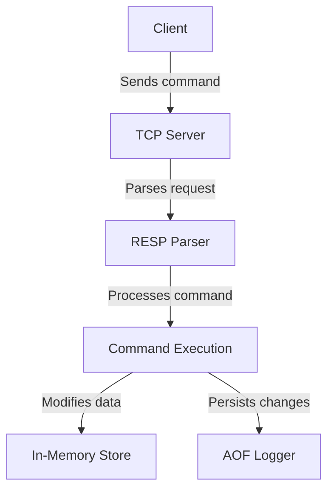

# GoBolt - A Redis-like In-Memory Database

GoBolt is a lightweight, Redis-like in-memory key-value store built with Go. It supports RESP protocol parsing, in-memory storage, and Append-Only File (AOF) persistence to ensure durability.

## Features

GoBolt implements several core Redis features:

✅ **In-Memory Storage** - Stores key-value pairs in memory for fast access.  
✅ **RESP Protocol Support** - Parses Redis Serialization Protocol (RESP) requests for communication.  
✅ **String Commands** - Supports basic Redis commands like `SET`, `GET`, `DEL`, etc.  
✅ **Append-Only File (AOF)** - Persists commands to disk to ensure durability.  
✅ **TCP Server** - Handles multiple client connections.  
✅ **Concurrency Handling** - Uses Go's goroutines for efficient request processing.  

---

## Installation

### Prerequisites
- Go (1.18+)

### Clone and Build
```sh
# Clone the repository
git clone https://github.com/hossainsmshakib/gobolt.git
cd gobolt

# Build the binary
go build -o gobolt

# Run the server
./gobolt
```

---

## Usage

You can interact with GoBolt using `redis-cli` or Telnet.

### Example Commands
```sh
# Set a key-value pair
SET mykey "Hello GoBolt!"

# Get the value of a key
GET mykey

# Delete a key
DEL mykey
```

---

## Architecture Overview

Below is a high-level overview of how GoBolt works:

```
Client -> TCP Server -> RESP Parser -> Command Execution -> Data Store -> AOF Persistence
```

### Flowchart


---

## Screenshots


---

## Future Improvements
- **Support for More Data Structures** (Lists, Hashes, Sets, etc.)
- **Snapshot-based Persistence (RDB)**
- **Replication & Clustering**

---

## License
MIT License

